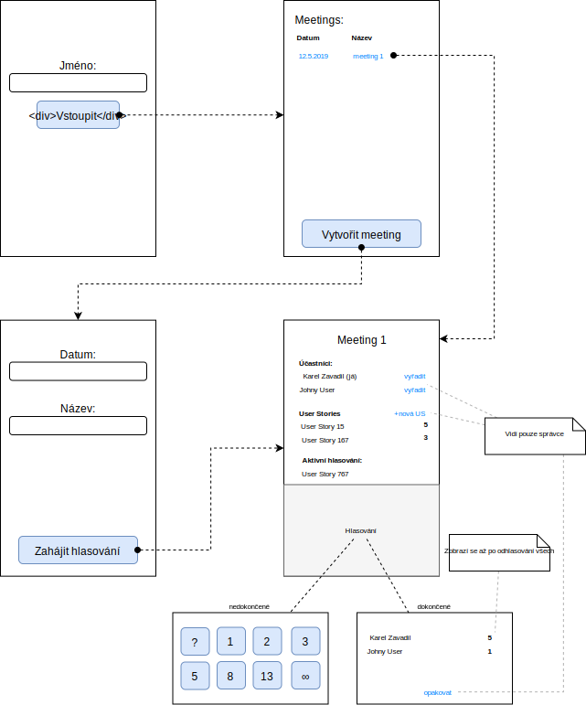

# Scrum Poker

## Účel aplikace

Aplikace bude sloužit k hlasování běhěm Scrum pokru. Předseda schůze postupně vkládá úkoly k hlasování a účastníci jim přidělují body. Hlavním přínosem aplikace je to, že výsledek se zviditelní až poté, co odhlasují všichni a nikdo tak není ovlivněn hlasováním ostatních.

Podobné aplikace již existují - důvod, proč vytváříme vlastní je, abychom si vyzkoušeli framework Nette na nějakém jednoduchém projektu.

## Funkční požadavky

1. Aplikace musí umožnit předsedovi schůze vložit úkol k hlasování
1. Aplikace musí umožnit předsedovi schůze zahájit hlasování k úkolu, a to i opakovaně
1. Aplikace musí umožnit předsedovi schůze vyřadit účastníka
1. Aplikace musí umožnit účastníkům schůze hlasovat k aktuálnímu úkolu
1. Aplikace musí automaticky ukončit hlasování poté, co všichni účastníci odhlasují.
1. Aplikace musí všem zobrazit výsledky hlasování a doporučit další postup (opakování hlasování, atd.)

## Kvalitativní požadavky

1. Aplikace musí být napsána v Nette
1. Aplikace musí být malá a snadno nasaditelná

## Případy užití (use cases)

### UC 1 - Vstoupit/přihlásit se do systému

1. Uživatel přijde na jakoukoliv stránku
1. IF (uživatel je přihlášen)
 - THEN end
 - ELSE GOTO 3
1. Systém zobrazí stránku přihlášení
1. Uživatel vyplní své méno
1. Uživatel klikne na tlačítko **Vstoupit**
1. Systém uživatele přihlásí
1. Systém zobrazí stránku s výběrem meetingu

### UC 2 - Založit meeting

Vstupní podmínky: uživatel je přihlášen

1. Uživatel přijde na titulní stránku
1. Uživatel klikne na tlačítko **Vytvořit meeting**
1. Systém zobrazí formulář pro vytvoření/editaci meetingu
1. Uživatel vyplní datum a název meetingu
1. Uživatel klikne na tlačítko **Zahájit meeting**
1. Systém vytvoří nový meeting
1. Systém přidá uživatele do účastníků meetingu 
1. Systém určí uživatele, který meeting vytvořil, jako jeho správce
1. Systém zobrazí stránku s detailem meetingu

### UC 3 - Stát se účastníkem meetingu

Vstupní podmínky: 
- uživatel je přihlášen
- uživatel je na titulní stránce

1. Uživatel klikne na název nebo datum meetingu ze seznamu
1. Systém přidá uživatele do účastníků meetingu 
1. Systém zobrazí stránku s detailem meetingu

### UC 4 - Přidat user story

Vstupní podmínky:
- uživatel je přihlášen
- uživatel je na stránce detailu meetingu

1. Uživatel klikne na tlačítko **Vytvořit novou user story**
1. Systém zobrazí formulář pro vytvoření/editaci user story
1. Uživatel vyplní název user story
1. Uživatel klikne na tlačítko **Uložit**
1. Systém vytvoří novou user story
1. Systém vrátí uživatele zpět na detail meetingu

### UC 5 - Zahájit hlasování

Vstupní podmínky: 
- uživatel je přihlášen
- uživatel je na detailu meetingu
- meeting nemá aktivní user story
- meeting má neodhlasované user story

1. Uživatel klikne na tlačítko **Zahájit hlasování** vedle názvu user story
1. Systém otevře hlasování (označení user story jako aktivní)
1. Systém zobrazí všem účastníkům nové hlasování

### UC 6 - Hlasovat o user story

Vstupní podmínky: 
- uživatel je přihlášen
- uživatel je na detailu meetingu
- meeting má aktivní hlasování

1. Systém zobrazí formulář pro výběr bodů
1. Uživatel zvolí počet bodů
1. Systém uloží hlasování uživatele
1. Systém zobrazí všem účastníkům meetingu informaci, že uživatel odhlasoval
1. IF (všichni účastníci již hlasovali)
 - THEN GOTO **UC 7**
 - ELSE end

### UC 7 - Vyhodnotit hlasování

Vstupní podmínky: 
- uživatel je přihlášen
- uživatel je na detailu meetingu
- meeting má aktivní hlasování
- všichni účastníci již hlasovali

1. Systém uzavře hlasování (zruší označení user story jako aktivní)
1. Systém zobrazí všem účastníkům výsledek hlasování
1. IF (alespoň jeden z účastníků zvolil otazník nebo nekonečno nebo účastníci hlasovali různě)
 - THEN systém zobrazí hlášku *hlasování nelze uzavřít*
 - ELSE
    - IF (všichni účastníci hlasovali stejně)
      - THEN (systém uloží počet bodů jako výsledek hlasování)
      - ELSE (všichni účastníci hlasovali s rozdílem max. 1 stupně => systém uloží vyšší počet bodů jako výsledek hlasování

### UC 8 - Opakovat hlasování

Vstupní podmínky: 
- uživatel je přihlášen
- uživatel je na detailu meetingu
- meeting nemá aktivní user story
- meeting již má odhlasované user story

1. Uživatel klikne na tlačítko **Opakovat hlasování**
1. Systém vytvoří nové hlasování pod stejnou user story a označí jej jako aktivní

### UC 9 - Vyřadit účastníka meetingu

Vstupní podmínky: 
- uživatel je přihlášen
- uživatel je na detailu meetingu
- uživatel je správce meetingu

1. Uživatel klikne na tlačítko **Vyřadit účastníka**
1. Systém odebere účastníka z meetingu

## Wireframes a navigace

## Datový model

