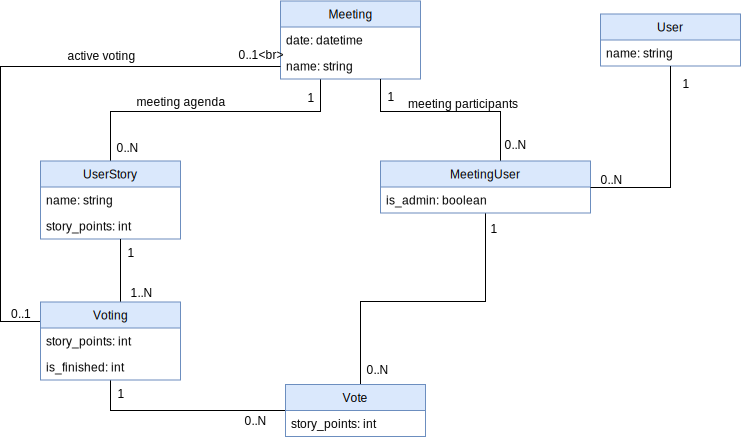

# Scrum Poker

## Účel aplikace

Aplikace bude sloužit k hlasování běhěm Scrum pokru. Předseda schůze postupně vkládá úkoly k hlasování a účastníci jim přidělují body. Hlavním přínosem aplikace je to, že výsledek se zviditelní až poté, co odhlasují všichni a nikdo tak není ovlivněn hlasováním ostatních.

Podobné aplikace již existují - důvod, proč vytváříme vlastní je, abychom si vyzkoušeli framework Nette na nějakém jednoduchém projektu.

## Funkční požadavky

1. Aplikace musí umožnit předsedovi schůze vložit úkol k hlasování
1. Aplikace musí umožnit předsedovi schůze zahájit hlasování k úkolu, a to i opakovaně
1. Aplikace musí umožnit předsedovi schůze vyřadit účastníka
1. Aplikace musí umožnit účastníkům schůze hlasovat k aktuálnímu úkolu
1. Aplikace musí automaticky ukončit hlasování poté, co všichni účastníci odhlasují.
1. Aplikace musí všem zobrazit výsledky hlasování a doporučit další postup (opakování hlasování, atd.)

## Kvalitativní požadavky

1. Aplikace musí být napsána v Nette
1. Aplikace musí být malá a snadno nasaditelná

## Datový model

